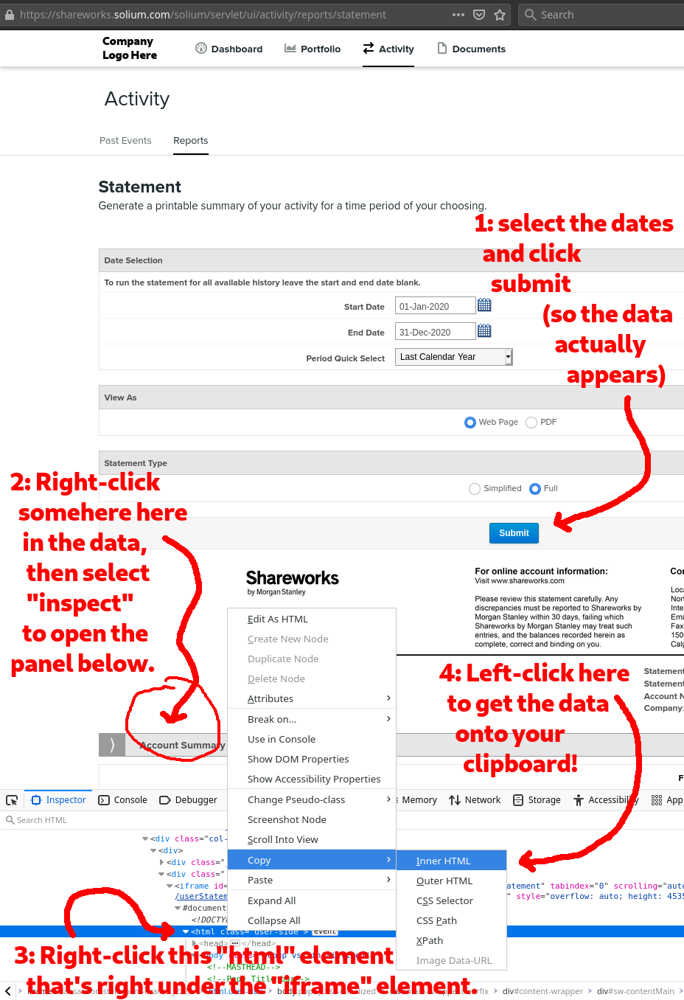

Shareworks-munger: A program to process Shareworks reports into Something Usable
================================================================================

"Shareworks" is a product of Morgan Stanley which tracks certain kinds of financial information
(specifically, stock and compentation-related information) and distributes reports about it to the receiptients.

Inscruitably, it offers this in two formats: a PDF, and an HTML page.
Both of them have tables in a format that will make your accountant absolutely scream -- they're not in rows; there'd be a ton of manual data re-entry; it's just no good.
There is no CSV export, or anything you'd expect.

This is a program that takes the HTML form, parses it, puts it into a sane columnar layout,
and **emits the data in CSV**.

That's it.

You can then open the CSV in Excel, or LibreOffice, or whatever you please.

What the Fuck?
--------------

We're talking about the data exports from a piece of software that's A) by a major financial company, and B) *literally* has no purpose except data reporting...

and I'm telling you that their exports are too batshit for an accountant to actually use?

Yes.  Yes I am.

I'm not kidding about turning dozens of pages into a few rows in the CSV form, either.  It's really obscene.

I cannot begin to speculate on what kind of failure of organization inside Morgan Stanley caused them to utterly fail to be able to do something like "emit a CSV report", but fail they did.

This is not software that should've needed to be written.

None the less, it was needed; and so I have written it.

License
-------

While I do hope you are not in the position of needing this, if you do, it is a free and open license.

More specifically: Apache2 or MIT licensed, at your option.

I really don't care what you do with it; I just want to increase the amount of sanity in the world, and this is a contribution.

How to Use
----------

### Requirements

1. You still have to log into the Shareworks website manually, and navigate to the reports, and save that webpage from your browser.
2. You'll need Git and a Golang compiler installed and some basic familiarity with working in the terminal.  (I couldn't be arsed to package this any better.  Sorry.)

In other words, this will require you to be somewhat technical, still.

If you'd like to make this more automated and easier to use, "PRs welcome", as we say in the tech industry.

### Steps

#### Getting the raw data

1. Log in to Shareworks.
2. Get the report onto your screen.
	- Click "Activity" at the top.
	- Click "Reports".
	- Do the date selection to whatever you want.
	- Leave the other options as "Web Page" and "Full".
	- Submit.
3. Now it gets fun.  We need the HTML from this, but we can't just save the page.
	- (Why can't we just save the page?  Because this website... it's incredible, in a bad way.  I don't wanna talk about it.  This is not how this website should've been written.)
	- Right-click somewhere in the report data, and then click "inspect".
		- Some crazy debugger thing just opened.  If you don't know what this is, don't worry, just hang on.
	- Scroll up until you see something that says `<iframe id="transaction-statement-iframe` (... and then some more stuff you can ignore; it just has to start like this).
	- Scroll *slightly* back down: You should see a bit that says `<html` right underneath the `<iframe`.  Right click on that.
	- Hover "Copy" in the right-click menu, then click "Inner HTML" -- or "Copy element" in Chrome.  (Whatever.)  You should now have a big hunk of juicy data on your clipboard!  We're almost there!
	- Dizzy?  See the screenshot below.
4. Paste that data from your clipboard into a file and save it.  Call it `wow.html` or whatever you want.
	- If you're not very tech savvy -- mind that this needs to be a "plain text" file.  Not a word document or whatever.  If that's not familar to you, I'm sorry; this is beyond my depth to explain in this readme.
5. HOORAY -- you are done with the browser now.  You can close it.

Here's a screenshot of what getting the raw HTML looks like:

Okay.  Phew.  Now on to actually running the munger.

#### Using the Munger

1. Git clone this repo, if you haven't already.
	- If you're not the kind of tech savvy for this -- I'm sorry; this is beyond my depth to explain in this readme.
2. You should have Golang installed.  Sanitycheck: you can run `go env` in the terminal, and it works, right?
	- If you're not the kind of tech savvy for this -- I'm sorry; this is beyond my depth to explain in this readme.
3. `go run ./main.go ./wow.html` -- or use whatever your filename was from step 4 above, when you got the data.
4. That's it!  The CSV data should've appeared on your terminal!
5. Redirect it to a file to save it: `go run ./main.go ./wow.html > sane.csv`

You should now be able to open `sane.csv` with Excel, or LibreOffice, or whatever you want!
And you can go ahead and send it to your accountant; they won't hate you anymore.
(Probably.  At least not for this issue.)
